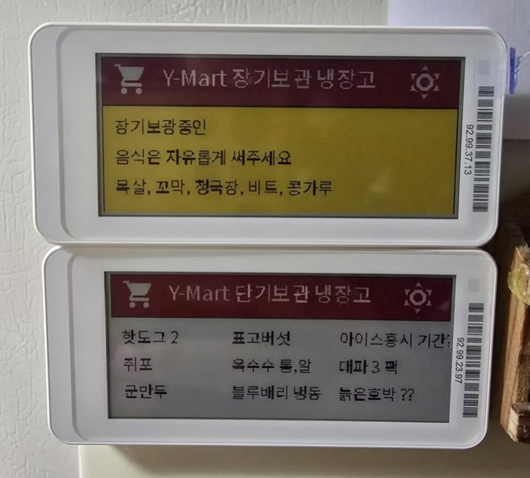
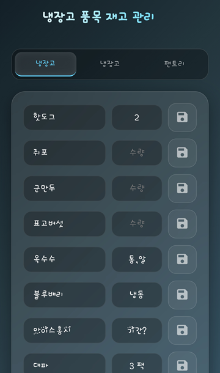
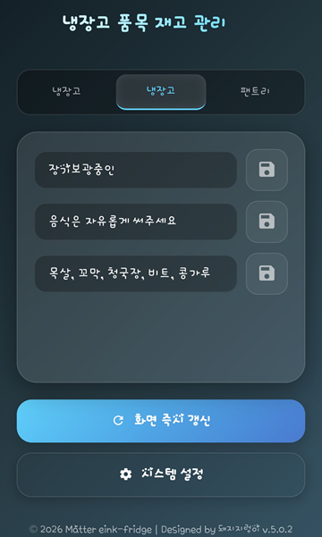
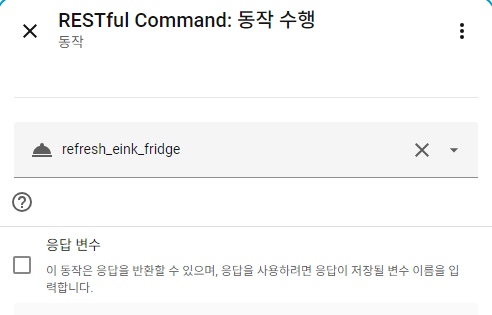

# E-ink Fridge Manager (Fridge Inventory Management v5.1.2)

<div align="center">
  
</div>

[English](#english) | [한국어](#한국어)

---

<a name="english"></a>
## English Version

### 1. Program Overview and Purpose
- **Purpose**: Automation of fridge inventory management using E-ink displays.
- **Overview**: Integrated management, editing, and updating of E-ink displays linked with Home Assistant (HA) via this application.
- **Key Features**:
  - Supports multiple categories (Fridge, Freezer, Pantry, etc.): Manage up to 4 E-ink displays with a single app.
  - **Two Input Modes**:
    - **Short Mode** (Item+Quantity)
    - **Long Mode** (Max 20-character text)

| Short Mode UI | Long Mode UI |
| :---: | :---: |
|  |  |

  - Real-time screen refresh via HA script integration.
  - Optimized for Synology NAS Docker (Container Manager).

### 2. References & Credits
Detailed instructions for connecting and installing E-ink displays with Home Assistant (HA) can be found in the post by **@취밍** on the Naver Cafe. I developed this app to introduce one of the efficient ways to utilize it.
- **"Every Smart Home" Cafe URL**: [https://cafe.naver.com/stsmarthome/101751](https://cafe.naver.com/stsmarthome/101751)
- **Gicisky Installation GitHub**: [https://github.com/eigger/hass-gicisky](https://github.com/eigger/hass-gicisky)

### 3. Prerequisites
1. **Synology NAS**: Must be running 24/7.
2. **Container Manager**: (formerly Docker) installed on NAS.
3. **DDNS/Reverse Proxy**: For external access via smartphone.

### 4. Installation Guide (6 Steps)

#### Step 1: Download Source (GitHub -> PC)
- The first step is to bring the latest source code from the GitHub repository to your computer.
- **How**: Click the `Code` button on the GitHub page and select **Download ZIP**, or use the `git clone` command if you're familiar with Git.

#### Step 2: Upload to NAS (PC -> NAS)
- Move the downloaded source files to the actual folder on your Synology NAS where the service will run.
- **How**: Open Synology **File Station**, create a new folder (e.g., `fridge-manager`) under the `docker` shared folder, and upload all the extracted files.

#### Step 3: Configure Environment (Optimization)
- This is a crucial step to modify the files to match your NAS and Home Assistant (HA) information.
- **How**: Rename `docker-compose.example.yml` to `docker-compose.yml`. Open it with a text editor and modify `HA_URL` and `HA_TOKEN` with your information. You can also decide the access port here (default is 3000).

#### Step 4: Deploy with Docker (Execution)
- This step actually starts the server on your NAS based on the modified source.
- **How**: Open the **Container Manager** app on your Synology NAS. Go to the **Project** menu, click **Create**, select the folder you uploaded files to, and build/run the project using the `docker-compose.yml` you just configuration.

#### Step 5: Initial App Setup (Internal Settings)
- Once the server is running, access the UI via browser to create the fridge categories you want to manage.
- **How**: Enter `http://[NAS_IP]:3000` in your browser. Click the **System Settings** icon (gear), go to **Tab Management**, add tabs like 'Fridge' or 'Freezer', and enter the **HA Script Entity (e.g., script.e_ink)** to be called when each tab is refreshed.
- **💡 How to find the Unique ID**: Each tab has its own **Category Unique ID (for HA Integration)**. You can find and copy this ID at the bottom of the **System Settings** modal for each tab. This ID is essential for Step 6.
  > [!IMPORTANT]
  > **Important Note on Unique ID**: If you delete a tab and recreate it, a **new Unique ID** is generated. You must update the new ID in HA's `secrets.yaml`. (IDs are preserved when only updating the tab name.)

#### Step 6: Home Assistant Integration (Final Connection)
- The final step is to complete the HA setup so that HA can read data from this server and send commands.
- **How**: Copy the code examples from the [HA Config Guide](#ha-config-en) below into your HA `configuration.yaml` or separate files (`sensors.yaml`, `scripts.yaml`). **Note**: Replace `<TAB_ID>` in the URLs with the **Unique ID** you copied in Step 5.
- **💡 Is `refresh_url` mandatory?**: If you only use the **App's Web UI** to refresh the screen, `refresh_url` is **optional**. However, it is **required** if you want to:
  - Create a "Refresh" button on the **HA Dashboard (Lovelace)**.
  - Set up **HA Automations** (e.g., "Refresh screen when the fridge door closes").
  - Trigger refresh directly from the **HA Mobile App**.

<a name="ha-config-en"></a>
### 5. Home Assistant (HA) Configuration Guide

#### A. secrets.yaml
```yaml
nas_server_ip: <YOUR_NAS_IP>
fridge_manager_port: 3000
ha_long_lived_token: "your_token_here"

# Mandatory settings (Data transfer from App to HA)
eink_url_1: "http://<IP>:3000/api/ha/<ID_1>"
eink_url_2: "http://<IP>:3000/api/ha/<ID_2>"
eink_url_3: "http://<IP>:3000/api/ha/<ID_3>"
eink_url_4: "http://<IP>:3000/api/ha/<ID_4>"

# Optional settings (Refreshing screen from HA Dashboard)
refresh_url_1: "http://<IP>:3000/api/refresh/<ID_1>"
refresh_url_2: "http://<IP>:3000/api/refresh/<ID_2>"
refresh_url_3: "http://<IP>:3000/api/refresh/<ID_3>"
refresh_url_4: "http://<IP>:3000/api/refresh/<ID_4>"
```

#### B. configuration.yaml (Rest Command)
```yaml
rest_command:
  # Examples split by Slots (1-4)
  refresh_eink_1:
    url: !secret refresh_url_1
    method: POST
  refresh_eink_2:
    url: !secret refresh_url_2
    method: POST
  # ... (Repeat for 3 and 4)
```

#### D. Triggering Refreshes from HA Dashboard
You can add a button to your HA dashboard to manually trigger a screen refresh:
1.  Add a **Button Card** to your dashboard.
2.  Set the **Tap Action** to **Perform Action** (or Call Service).
3.  Select the action: `rest_command.refresh_eink_1` (or the name you defined).

<div align="center">
  
  <p><i>Example: Triggering the refresh action from HA UI</i></p>
</div>

#### C. sensors.yaml (Rest Sensor)
```yaml
- platform: rest
  name: "Fridge Slot 1"
  resource: !secret eink_url_1
  value_template: "{{ value_json.items | length }}"
  json_attributes: [ "items" ]
  scan_interval: 60

- platform: rest
  name: "Fridge Slot 2"
  resource: !secret eink_url_2
  value_template: "{{ value_json.items | length }}"
  json_attributes: [ "items" ]
  scan_interval: 60

# ... (Repeat for Slot 3 and 4)
```

### 6. Important Notes
- **Security**: Never share your `HA_TOKEN`.
- **Local Network**: Recommended for use within a secured local network or via VPN/Reverse Proxy.
- **Unique ID Sync**: If you delete and recreate a category, its **Unique ID** will change. Don't forget to update the corresponding ID in your Home Assistant `secrets.yaml` to maintain the connection.

### 7. Tips & Tricks

#### 1. Input Modes (Dynamic UI)
You can optimize the input environment based on the characteristics of each tab (e.g., Fridge vs. Kimchi Fridge). You can set the mode for each tab in **[System Settings]** at the bottom of the app.

* **🍅 Short-term Mode (Standard / Default)**
  * **Recommended Use**: Environments requiring frequent stock management such as Fridge, Pantry, etc.
  * **Input Type**: Separate Item Name (Max 6 chars) + Quantity (Max 3 chars).
  * **Display Settings**: Select 3 / 6 / 9 items.
  * **E-ink Rendering**: Outputs in a 3x3 grid "Standard Layout".

* **🧊 Long-term Mode (Memo-style)**
  * **Recommended Use**: Environments where detailed memos (storage date, expiration date, etc.) are more important than quantity, such as Kimchi Fridge or storage rooms.
  * **Input Type**: Wide text bar utilizing 100% width (Max 20 chars per line).
  * **Display Settings**: Select 3 / 4 items.
  * **E-ink Rendering**: Automatically switches to a "3 or 4-row Wide Layout" designed with a golden ratio (20 chars) to prevent text clipping on a 2.9-inch panel.

#### 2. HA Script Branching Logic (Branching Logic)
This is an example of automatically switching the display layout based on the mode (Short/Long) and the number of items (3/4).

[Script YAML Example]

```yaml
alias: Fridge E-ink Inventory (No.1) - 3Way Multi Layout
description: Automatically switches between 3 layouts based on injected variables (mode, count).
sequence:
  - choose:
      - conditions:
          - condition: template
            value_template: "{{ mode == 'long' and count == 4 }}"
            alias: "Long-term: 4-row Layout"
        sequence:
          - action: gicisky.write
            target:
              device_id: <YOUR_DEVICE_ID>
            data:
              payload:
                payload:
                  - type: rectangle
                    x_start: 0
                    y_start: 0
                    x_end: 295
                    y_end: 128
                    fill: yellow
                  - type: text
                    x: 10
                    "y": 8
                    size: 14
                    value: "{{ pummog1 | default('') }} {{ suryang1 | default('') }}"
                  - type: rectangle
                    x_start: 10
                    y_start: 31
                    x_end: 285
                    y_end: 31
                    fill: black
                  - type: text
                    x: 10
                    "y": 40
                    size: 14
                    value: "{{ pummog2 | default('') }} {{ suryang2 | default('') }}"
                  - type: rectangle
                    x_start: 10
                    y_start: 63
                    x_end: 285
                    y_end: 63
                    fill: black
                  - type: text
                    x: 10
                    "y": 72
                    size: 14
                    value: "{{ pummog3 | default('') }} {{ suryang3 | default('') }}"
                  - type: rectangle
                    x_start: 10
                    y_start: 95
                    x_end: 285
                    y_end: 95
                    fill: black
                  - type: text
                    x: 10
                    "y": 104
                    size: 14
                    value: "{{ pummog4 | default('') }} {{ suryang4 | default('') }}"
      - conditions:
          - condition: template
            value_template: "{{ mode == 'long' }}"
            alias: "Long-term: 3-row Layout (Default)"
        sequence:
          - action: gicisky.write
            target:
              device_id: <YOUR_DEVICE_ID>
            data:
              payload:
                payload:
                  - type: rectangle
                    x_start: 0
                    y_start: 0
                    x_end: 295
                    y_end: 38
                    fill: red
                  - type: rectangle
                    x_start: 0
                    y_start: 39
                    x_end: 295
                    y_end: 128
                    fill: yellow
                  - type: icon
                    x: 10
                    "y": 3
                    value: mdi:cart
                    size: 30
                    color: yellow
                  - type: text
                    x: 50
                    "y": 8
                    color: white
                    size: 18
                    value: "Long-term: {{ category | default('Mart') }}"
                  - type: text
                    x: 10
                    "y": 50
                    size: 14
                    value: "{{ pummog1 | default('') }}"
                  - type: rectangle
                    x_start: 10
                    y_start: 69
                    x_end: 285
                    y_end: 69
                    fill: black
                  - type: text
                    x: 10
                    "y": 75
                    size: 14
                    value: "{{ pummog2 | default('') }}"
                  - type: rectangle
                    x_start: 10
                    y_start: 94
                    x_end: 285
                    y_end: 94
                    fill: black
                  - type: text
                    x: 10
                    "y": 100
                    size: 14
                    value: "{{ pummog3 | default('') }}"
                  - type: icon
                    x: 250
                    "y": 2
                    size: 34
                    color: white
                    value: >-
                      
                      
                        mdi:weather-sunny
                      
                        mdi:weather-cloudy
                      
                        mdi:weather-pouring
                      
                        mdi:weather-snowy
                      
                        mdi:weather-partly-cloudy
                      
      - conditions:
          - condition: template
            value_template: "{{ mode != 'long' }}"
            alias: "Short-term Layout"
        sequence:
          - action: gicisky.write
            target:
              device_id: <YOUR_DEVICE_ID>
            data:
              payload:
                payload:
                  - type: rectangle
                    x_start: 0
                    y_start: 0
                    x_end: 295
                    y_end: 38
                    fill: red
                  - type: rectangle
                    x_start: 0
                    y_start: 39
                    x_end: 295
                    y_end: 128
                    fill: yellow
                  - type: icon
                    x: 10
                    "y": 3
                    value: mdi:cart
                    size: 30
                    color: yellow
                  - type: text
                    x: 50
                    "y": 8
                    color: white
                    size: 18
                    value: "{{ category | default('Mart') }} Inventory"
                  - type: text
                    x: 10
                    "y": 50
                    size: 14
                    value: "{{ pummog1 | default('') }} {{ suryang1 | default('') }}"
                  - type: text
                    x: 10
                    "y": 75
                    size: 14
                    value: "{{ pummog2 | default('') }} {{ suryang2 | default('') }}"
                  - type: text
                    x: 10
                    "y": 100
                    size: 14
                    value: "{{ pummog3 | default('') }} {{ suryang3 | default('') }}"
                  - type: text
                    x: 105
                    "y": 50
                    size: 14
                    value: "{{ pummog4 | default('') }} {{ suryang4 | default('') }}"
                  - type: text
                    x: 105
                    "y": 75
                    size: 14
                    value: "{{ pummog5 | default('') }} {{ suryang5 | default('') }}"
                  - type: text
                    x: 105
                    "y": 100
                    size: 14
                    value: "{{ pummog6 | default('') }} {{ suryang6 | default('') }}"
                  - type: text
                    x: 200
                    "y": 50
                    size: 14
                    value: "{{ pummog7 | default('') }} {{ suryang7 | default('') }}"
                  - type: text
                    x: 200
                    "y": 75
                    size: 14
                    value: "{{ pummog8 | default('') }} {{ suryang8 | default('') }}"
                  - type: text
                    x: 200
                    "y": 100
                    size: 14
                    value: "{{ pummog9 | default('') }} {{ suryang9 | default('') }}"
                  - type: icon
                    x: 250
                    "y": 2
                    size: 34
                    color: white
                    value: >-
                      
                      
                        mdi:weather-sunny
                      
                        mdi:weather-cloudy
                      
                        mdi:weather-pouring
                      
                        mdi:weather-snowy
                      
                        mdi:weather-partly-cloudy
                      
```

---

<a name="한국어"></a>
## 한국어 버전 (Korean Version)

<div align="center">
  
</div>

### 1. 프로그램 개요 및 목적
- **목적**: 냉장고 재고관리를 위한 E-ink 디스플레이 활용 자동화.
- **개요**: HA와 연동된 E-ink 디스플레이의 내용을 앱을 통해 통합 관리하고 즉시 갱신합니다.
- **주요 기능**:
  - 다중 카테고리 지원 (냉장고, 냉동고, 팬트리 등) : E-ink 디스플레이를 최대 4개까지 앱 하나로 관리.
  - **두 가지 입력 모드 선택 가능**:
    - **단기 모드**(품목+수량)
    - **장기 모드**(메모형)

| 단기 모드 UI (Short) | 장기 모드 UI (Long) |
| :---: | :---: |
|  |  |

  - HA 스크립트 연동 실시간 화면 갱신.
  - 시놀로지 NAS Docker 환경 최적화.

### 2. 참고 자료 및 출처 (References)
E-ink 디스플레이와 HA의 연결 방법 및 설치는 Naver Cafe **@취밍**님의 글에 자세히 안내되어 있습니다. 저는 이것을 효율적으로 이용할 수 있는 방법 중 하나를 소개하며 이 앱을 제작해보았습니다.
- **모두의 스마트홈 카페**: [https://cafe.naver.com/stsmarthome/101751](https://cafe.naver.com/stsmarthome/101751)
- **Gicisky 설치 GitHub**: [https://github.com/eigger/hass-gicisky](https://github.com/eigger/hass-gicisky)

### 3. 사용자 기초 지식 (Prerequisites)
1. **시놀로지 NAS**: 24시간 가동되는 개인용 서버.
2. **Container Manager**: (구 Docker) 패키지 설치 필요.
3. **DDNS/외부접속**: 외부(스마트폰)에서 접속을 위한 설정 완료 상태.

### 4. 설치 및 배포 순서 (6단계)

#### 단계 1: 소스 코드 다운로드 (GitHub -> PC)
- 가장 먼저 GitHub 저장소에 올라가 있는 최신 소스 코드를 내 컴퓨터로 가져오는 단계입니다.
- **방법**: GitHub 페이지에서 `Code` 버튼을 눌러 **Download ZIP**을 하거나, Git을 사용하신다면 `git clone` 명령어를 사용하세요.

#### 단계 2: NAS로 파일 업로드 (PC -> NAS)
- 다운로드한 소스 파일들을 실제 서비스가 돌아갈 시놀로지 NAS의 폴더로 옮기는 단계입니다.
- **방법**: 시놀로지 **File Station**을 열고, `docker` 공유 폴더 아래에 새 폴더(예: `fridge-manager`)를 만든 뒤 압축을 푼 파일들을 모두 업로드합니다.

#### 단계 3: 환경 변수 설정 (설정 최적화)
- 내 NAS와 Home Assistant(HA) 정보에 맞게 파일을 수정하는 중요한 단계입니다.  
- **방법**: 먼저 `docker-compose.example.yml` 파일의 이름을 `docker-compose.yml`로 변경합니다. 그 후 메모장 등으로 파일을 열어 `HA_URL`(HA 주소)과 `HA_TOKEN`(롱리브드 토큰)을 본인의 정보로 수정합니다. 접속 포트(기본 3000)도 여기서 결정합니다.

#### 단계 4: Docker 컨테이너 생성 (배포 실행)
- 수정한 소스를 바탕으로 NAS에서 서버를 실제로 가동시키는 단계입니다.
- **방법**: 시놀로지 **Container Manager** 앱을 실행합니다. **프로젝트** 메뉴에서 **생성**을 누르고, 아까 파일을 올린 폴더를 선택한 뒤 설정 완료한 `docker-compose.yml`을 이용해 프로젝트를 빌드 및 실행합니다.

#### 단계 5: 앱 초기 설정 및 탭 등록 (앱 내부 설정)
- 서버가 켜지면 브라우저로 접속해 내가 관리할 냉장고 카테고리를 만드는 단계입니다.
- **방법**: 브라우저에서 `http://<NAS_IP>:3000`으로 접속합니다. **시스템 설정** 아이콘을 눌러 '냉장고', '냉동고' 같은 탭을 추가하고, 각 탭이 갱신될 때 실행할 **HA에서 만든 스크립트 엔티티(ex. script.e_ink)**를 입력해 연결합니다.
- **💡 고유 ID 확인 방법**: 각 탭은 고유한 ID를 가지고 있습니다. **시스템 설정** 창 하단에 있는 **카테고리 고유 ID (HA 연동용)** 항목에서 이 코드를 확인하고 복사할 수 있습니다. 이 ID는 6단계 연동에 필수적으로 사용됩니다.
  > [!IMPORTANT]
  > **고유 ID 관련 주의사항**: 탭을 삭제하고 다시 생성하면 매번 **새로운 고유 ID**가 발급됩니다. 이 경우 Home Assistant의 `secrets.yaml`에 등록된 기존 ID도 반드시 새 ID로 업데이트해 주어야 연동이 유지됩니다. (탭 이름만 변경하는 경우는 ID가 유지됩니다.)

#### 단계 6: Home Assistant 연동 및 센서 등록 (최종 연결)
- 마지막으로 HA가 이 서버의 데이터를 읽어오고 명령을 내릴 수 있게 HA 설정을 마무리하는 단계입니다.
- **방법**: 아래의 [HA 설정 가이드](#ha-config-ko)를 참고하여 HA의 `configuration.yaml` 또는 분리된 파일(`sensors.yaml`, `scripts.yaml`)에 코드 예시를 복사해 넣습니다. **주의**: 주소 파라미터의 `<고유ID>` 부분을 5단계에서 복사한 실제 ID로 교체해야 합니다.
- **💡 `refresh_url`이 꼭 필요한가요?**: 만약 **앱(웹 UI)**의 버튼만 사용하여 화면을 갱신한다면 이 설정은 **옵션(선택 사항)**입니다. 하지만 아래와 같은 경우에는 반드시 등록해야 합니다:
  - **HA 대시보드(Lovelace)**에 "냉장고 갱신" 버튼을 따로 만들고 싶을 때
  - **HA 자동화(Automation)**를 설정하고 싶을 때 (예: "냉장고 문이 닫히면 1분 뒤에 화면 갱신")
  - **HA 모바일 앱**에서 직접 갱신 명령을 내리고 싶을 때

<a name="ha-config-ko"></a>
### 5. Home Assistant (HA) 설정 가이드

#### A. secrets.yaml (정보 보호)
```yaml
nas_server_ip: <NAS_IP_주소>
fridge_manager_port: 3000
ha_long_lived_token: "본인의_토큰_입력"

# 앱에서 HA로 데이터 전송을 위한 필수 설정
eink_url_1: "http://<IP>:3000/api/ha/<고유ID_1>"
eink_url_2: "http://<IP>:3000/api/ha/<고유ID_2>"
eink_url_3: "http://<IP>:3000/api/ha/<고유ID_3>"
eink_url_4: "http://<IP>:3000/api/ha/<고유ID_4>"

# HA 대시보드에서 화면 갱신 사용 시 선택적 설정
refresh_url_1: "http://<IP>:3000/api/refresh/<고유ID_1>"
refresh_url_2: "http://<IP>:3000/api/refresh/<고유ID_2>"
refresh_url_3: "http://<IP>:3000/api/refresh/<고유ID_3>"
refresh_url_4: "http://<IP>:3000/api/refresh/<고유ID_4>"
```

#### B. configuration.yaml (화면 갱신 명령)
```yaml
rest_command:
  # 슬롯별 갱신 명령 (1~4번 중 필요한 만큼 등록)
  refresh_eink_1:
    url: !secret refresh_url_1
    method: POST
  refresh_eink_2:
    url: !secret refresh_url_2
    method: POST
  # ... (3, 4번도 동일한 패턴으로 추가 가능)
```

#### D. HA 대시보드에서 사용 방법 (수동 갱신 버튼)
HA 대시보드에 버튼을 추가하여 필요할 때 즉시 화면을 갱신할 수 있습니다:
1.  대시보드 편집 모드에서 **버튼 카드**를 추가합니다.
2.  **누르기 동작**을 **동작 수행**(또는 서비스 호출)으로 설정합니다.
3.  동작 항목에서 `rest_command.refresh_eink_1` (또는 본인이 정의한 이름)을 선택합니다.

<div align="center">
  
  <p><i>예시: HA 인터페이스에서 갱신 동작을 호출하는 모습</i></p>
</div>

#### C. sensors.yaml (데이터 동기화 센서)
```yaml
- platform: rest
  name: "냉장고 인벤토리 1"
  resource: !secret eink_url_1
  value_template: "{{ value_json.items | length }}" 
  json_attributes:
    - "items" 
  scan_interval: 60

- platform: rest
  name: "냉장고 인벤토리 2"
  resource: !secret eink_url_2
  value_template: "{{ value_json.items | length }}" 
  json_attributes:
    - "items" 
  scan_interval: 60

# ... (3, 4번도 동일한 패턴으로 추가 가능)
```

### 6. 주의 사항
- **보안**: `HA_TOKEN`이 외부로 노출되지 않도록 주의하세요 .
- **인증서**: 로컬 환경 또는 보안된 역방향 프록시 환경에서 사용을 권장합니다.
- **고유 ID 갱신**: 앱에서 카테고리(탭)를 삭제하고 다시 생성하면 **새로운 고유 ID**가 부여됩니다. 이 경우 Home Assistant의 `secrets.yaml`에 등록된 기존 ID도 반드시 새 ID로 수정해야 연동이 정상적으로 작동합니다.

### 7. 활용 팁 (Tips & Tricks)

### 1. 단기/장기 보관 모드 (Dynamic UI)
각 탭의 성격(예: 냉장고 vs 김치냉장고)에 따라 입력 환경을 최적화할 수 있습니다. 앱 하단의 **[시스템 설정]**에서 탭별로 모드를 다르게 지정할 수 있습니다.

* **🍅 단기 모드 (Short-term / 기본값)**
  * **권장 용도:** 냉장고, 팬트리 등 잦은 입출고와 수량 관리가 필요한 환경
  * **입력 방식:** 품목명(최대 6자) + 수량(최대 3자) 분리 입력
  * **화면 개수:** 3개 / 6개 / 9개 선택 가능
  * **E-ink 렌더링:** 3x3 그리드 형태의 9구역 스탠다드 레이아웃으로 출력됩니다.

* **🧊 장기 모드 (Long-term)**
  * **권장 용도:** 김치냉장고, 다용도실 등 수량보다는 '상세 메모(보관일자, 유통기한 등)'가 필요한 환경
  * **입력 방식:** 가로폭을 100% 활용하는 와이드 텍스트 바 (1줄당 최대 20자 제한)
  * **화면 개수:** 3개 / 4개 선택 가능
  * **E-ink 렌더링:** 수량 표기를 생략하고 2.9인치 패널에 텍스트가 잘리지 않도록 황금 비율(20자)로 설계된 3줄 와이드 레이아웃으로 자동 전환됩니다.

### 2. HA 스크립트 동적 분기 (Branching Logic)
단기 / 장기 모드 및 설정 항목 개수(3개/4개)에 따라 디스플레이 레이아웃을 자동으로 전환하는 예제입니다.

[스크립트 yaml 예제]

```yaml
alias: 냉장고 E-ink 재고 (No.1) - 3Way 멀티 레이아웃
description: 앱에서 주입된 변수(mode, count)에 따라 3가지 레이아웃을 자동 전환합니다.
sequence:
  - choose:
      - conditions:
          - condition: template
            value_template: "{{ mode == 'long' and count == 4 }}"
            alias: "장기 저장: 4줄 레이아웃"
        sequence:
          - action: gicisky.write
            target:
              device_id: <YOUR_DEVICE_ID>
            data:
              payload:
                payload:
                  - type: text
                    x: 10
                    "y": 8
                    size: 14
                    value: "{{ pummog1 | default('') }} {{ suryang1 | default('') }}"
                  - type: rectangle
                    x_start: 10
                    y_start: 31
                    x_end: 285
                    y_end: 31
                    fill: black
                  - type: text
                    x: 10
                    "y": 40
                    size: 14
                    value: "{{ pummog2 | default('') }} {{ suryang2 | default('') }}"
                  - type: rectangle
                    x_start: 10
                    y_start: 63
                    x_end: 285
                    y_end: 63
                    fill: black
                  - type: text
                    x: 10
                    "y": 72
                    size: 14
                    value: "{{ pummog3 | default('') }} {{ suryang3 | default('') }}"
                  - type: rectangle
                    x_start: 10
                    y_start: 95
                    x_end: 285
                    y_end: 95
                    fill: black
                  - type: text
                    x: 10
                    "y": 104
                    size: 14
                    value: "{{ pummog4 | default('') }} {{ suryang4 | default('') }}"
      - conditions:
          - condition: template
            value_template: "{{ mode == 'long' }}"
            alias: "장기 저장: 3줄 레이아웃 (기본)"
        sequence:
          - action: gicisky.write
            target:
              device_id: <YOUR_DEVICE_ID>
            data:
              payload:
                payload:
                  - type: rectangle
                    x_start: 0
                    y_start: 0
                    x_end: 295
                    y_end: 38
                    fill: red
                  - type: rectangle
                    x_start: 0
                    y_start: 39
                    x_end: 295
                    y_end: 128
                    fill: yellow
                  - type: icon
                    x: 10
                    "y": 3
                    value: mdi:cart
                    size: 30
                    color: yellow
                  - type: text
                    x: 50
                    "y": 8
                    color: white
                    size: 18
                    value: "장기보관: {{ category | default('마트') }}"
                  - type: text
                    x: 10
                    "y": 50
                    size: 14
                    value: "{{ pummog1 | default('') }}"
                  - type: rectangle
                    x_start: 10
                    y_start: 69
                    x_end: 285
                    y_end: 69
                    fill: black
                  - type: text
                    x: 10
                    "y": 75
                    size: 14
                    value: "{{ pummog2 | default('') }}"
                  - type: rectangle
                    x_start: 10
                    y_start: 94
                    x_end: 285
                    y_end: 94
                    fill: black
                  - type: text
                    x: 10
                    "y": 100
                    size: 14
                    value: "{{ pummog3 | default('') }}"
                  - type: icon
                    x: 250
                    "y": 2
                    size: 34
                    color: white
                    value: >-
                      
                      
                        mdi:weather-sunny
                      
                        mdi:weather-cloudy
                      
                        mdi:weather-pouring
                      
                        mdi:weather-snowy
                      
                        mdi:weather-partly-cloudy
                      
      - conditions:
          - condition: template
            value_template: "{{ mode != 'long' }}"
            alias: "단기 저장 레이아웃"
        sequence:
          - action: gicisky.write
            target:
              device_id: <YOUR_DEVICE_ID>
            data:
              payload:
                payload:
                  - type: rectangle
                    x_start: 0
                    y_start: 0
                    x_end: 295
                    y_end: 38
                    fill: red
                  - type: rectangle
                    x_start: 0
                    y_start: 39
                    x_end: 295
                    y_end: 128
                    fill: yellow
                  - type: icon
                    x: 10
                    "y": 3
                    value: mdi:cart
                    size: 30
                    color: yellow
                  - type: text
                    x: 50
                    "y": 8
                    color: white
                    size: 18
                    value: "{{ category | default('마트') }} 재고"
                  - type: text
                    x: 10
                    "y": 50
                    size: 14
                    value: "{{ pummog1 | default('') }} {{ suryang1 | default('') }}"
                  - type: text
                    x: 10
                    "y": 75
                    size: 14
                    value: "{{ pummog2 | default('') }} {{ suryang2 | default('') }}"
                  - type: text
                    x: 10
                    "y": 100
                    size: 14
                    value: "{{ pummog3 | default('') }} {{ suryang3 | default('') }}"
                  - type: text
                    x: 105
                    "y": 50
                    size: 14
                    value: "{{ pummog4 | default('') }} {{ suryang4 | default('') }}"
                  - type: text
                    x: 105
                    "y": 75
                    size: 14
                    value: "{{ pummog5 | default('') }} {{ suryang5 | default('') }}"
                  - type: text
                    x: 105
                    "y": 100
                    size: 14
                    value: "{{ pummog6 | default('') }} {{ suryang6 | default('') }}"
                  - type: text
                    x: 200
                    "y": 50
                    size: 14
                    value: "{{ pummog7 | default('') }} {{ suryang7 | default('') }}"
                  - type: text
                    x: 200
                    "y": 75
                    size: 14
                    value: "{{ pummog8 | default('') }} {{ suryang8 | default('') }}"
                  - type: text
                    x: 200
                    "y": 100
                    size: 14
                    value: "{{ pummog9 | default('') }} {{ suryang9 | default('') }}"
                  - type: icon
                    x: 250
                    "y": 2
                    size: 34
                    color: white
                    value: >-
                      
                      
                        mdi:weather-sunny
                      
                        mdi:weather-cloudy
                      
                        mdi:weather-pouring
                      
                        mdi:weather-snowy
                      
                        mdi:weather-partly-cloudy
                      
```

---
**Designed by 돼지지렁이 (PigWorm) v.5.1.2**
